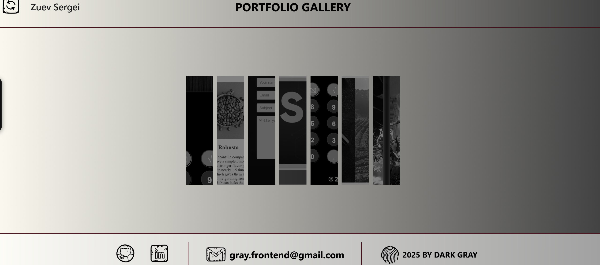

# Gray's Portfolio | グレイのポートフォリオ

A modern interactive portfolio built with **Vue 3** and **Nuxt 4**, featuring smooth 3D-style animations, custom SVG cursors, and a responsive layout.  
This site showcases my selected front-end projects, from small interactive apps to full Nuxt deployments.

Vue 3 と Nuxt 4 を使って構築した、モダンでインタラクティブなポートフォリオサイトです。
3D風アニメーション、カスタムSVGカーソル、レスポンシブデザインを搭載し、フロントエンド作品を直感的に閲覧できます。

🌐 **Live Demo:** | デモサイト: [Visit Portfolio | ポートフォリオを見る](https://portfolio-bygray.netlify.app/)  

---

## ✨ Features | 特徴
- **Vue 3 + Nuxt 4** architecture
　・**Vue 3 + Nuxt 4** アーキテクチャ
- **Custom animations** with CSS transforms & perspective
　・CSSトランスフォーム & パースペクティブによる**カスタムアニメーション**
- **Interactive project cards** with direct link & GitHub source access
　・**プロジェクトカード**から直接サイトとGitHubコードへアクセス
- **Custom cursor system** (SVG/PNG)
　・**カスタムカーソル**（SVG/PNG）
- **Fully responsive** design for desktop and mobile
　・**デスクトップ & モバイル**対応
- **Optimized for performance** and smooth transitions
　・**高パフォーマンス**でスムーズな動作

---

## 📂 Projects Included | 掲載プロジェクト
- **Vue_3D_Calculator** – Nuxt-based 3D styled calculator
　・**Vue_3D_Calculator** – Nuxtベースの3Dスタイル電卓
- **Vue_Coffee_Break** – Coffee shop concept site 
　・**Vue_Coffee_Break** – カフェサイトコンセプト 
- **Vue_Weekly_Anime** – Anime schedule & info site 
　・**Vue_Weekly_Anime** – アニメ放送スケジュールサイト
- **Vanilla JS projects** – Original JavaScript-based versions
　・**Vanilla JS プロジェクト** – JavaScript版オリジナル作品

---

## 🛠 Tech Stack | 技術スタック
- **Frontend:** Vue 3, Nuxt 4
　・**フロントエンド**: Vue 3, Nuxt 4
- **Styling:** Modern CSS, custom media queries, animations
　・**スタイリング**: 最新CSS, メディアクエリ, アニメーション
- **Deployment:** Netlify / GitHub Pages
　・**デプロイ**: Netlify / GitHub Pages

---

## 📸 Screenshots | スクリーンショット


---

## 📦 Installation & Setup | セットアップ方法
```bash
# Clone the repository
git clone https://github.com/GrayMurakami/my-portfolio-1.1.git

# Navigate to the folder
cd my-portfolio-1.1

# Install dependencies
npm install

# Run development server
npm run dev

# Build for production
npm run build
